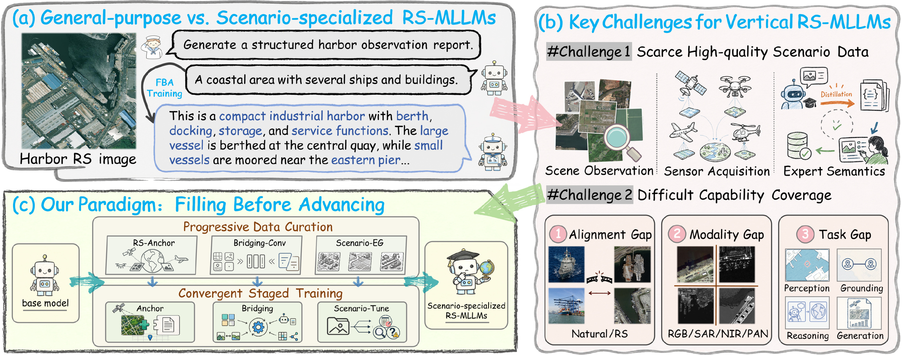
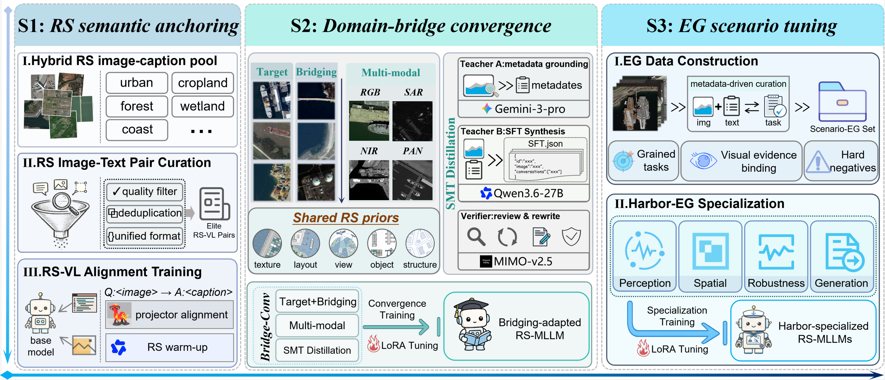
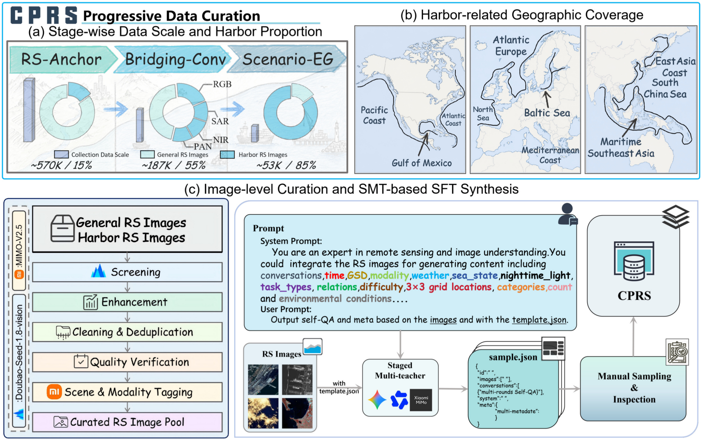
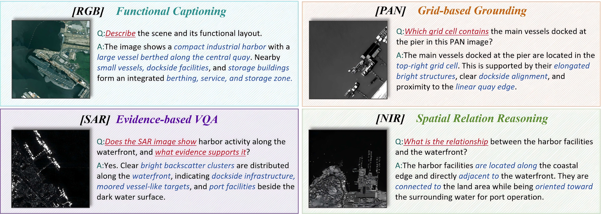
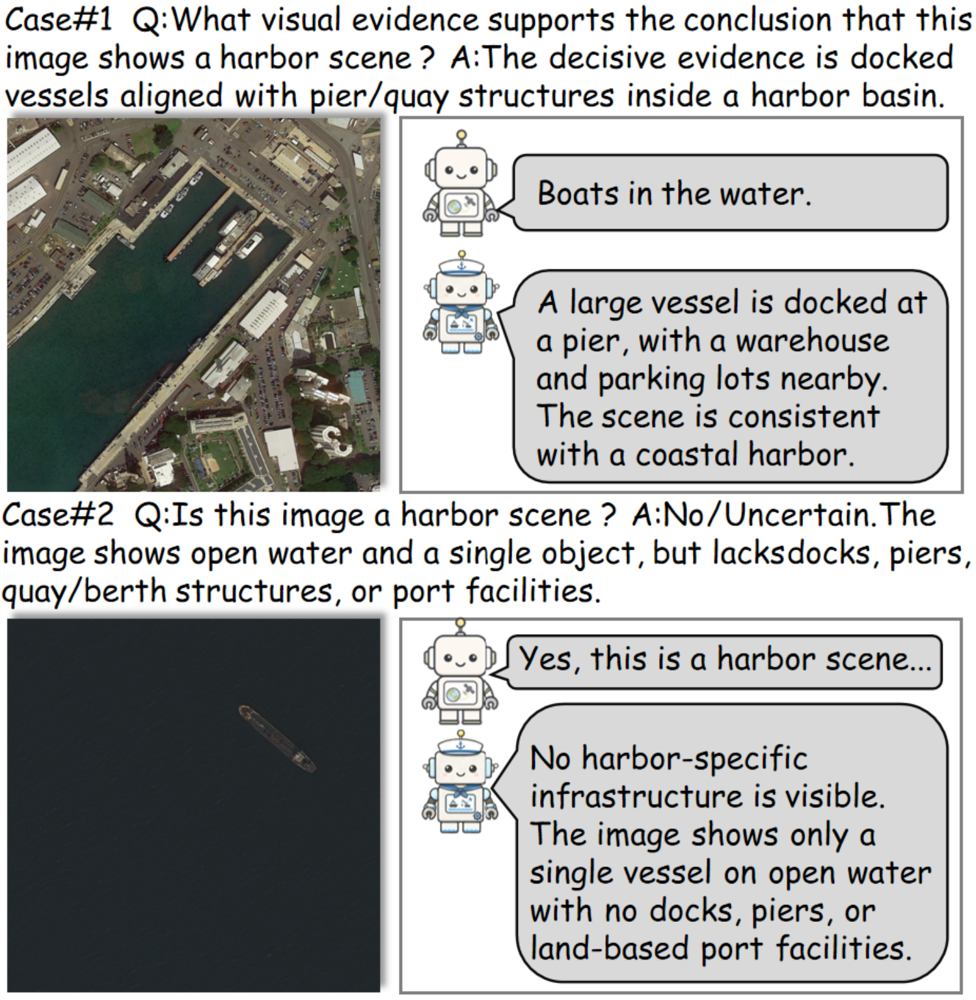
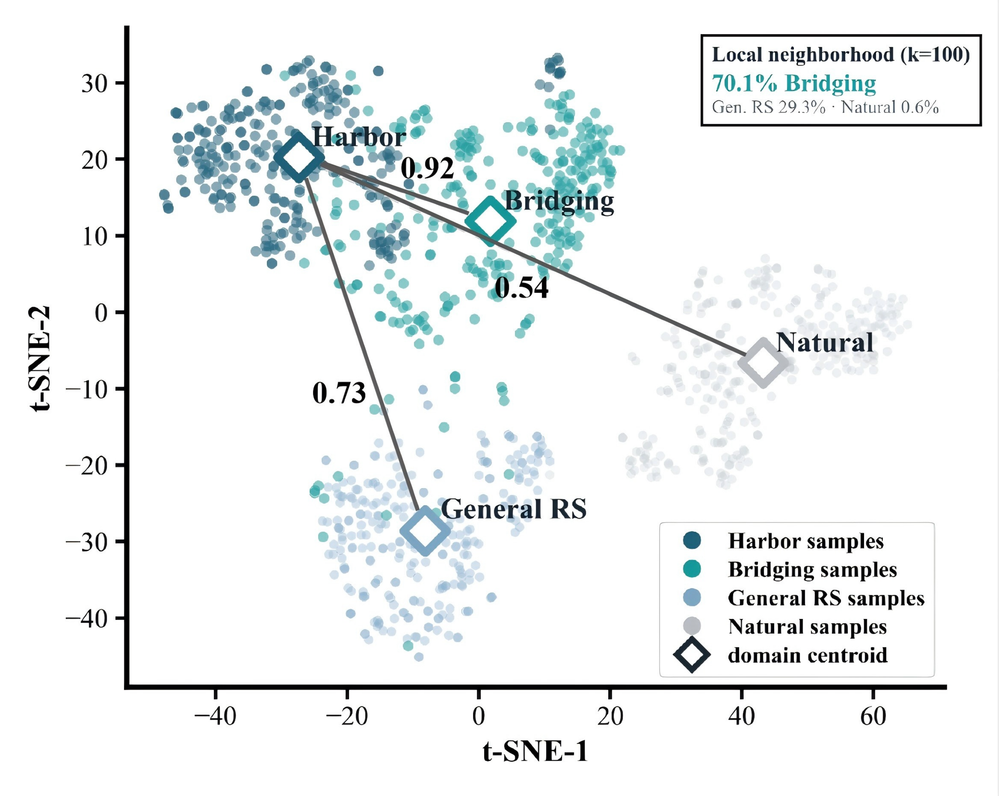

<div align="center">

# Filling Before Advancing

### 面向场景专用遥感多模态大语言模型的能力缺口驱动后训练

<p align="center">
  <a href="https://arxiv.org/search/cs?searchtype=author&query=Zong,+Y">Yuheng Zong</a>, <a href="https://arxiv.org/search/cs?searchtype=author&query=Wang,+M">Minghua Wang</a>, <a href="https://arxiv.org/search/cs?searchtype=author&query=Zhao,+X">Xin Zhao</a>, <a href="https://arxiv.org/search/cs?searchtype=author&query=Zhan,+Z">Zhi-Hui Zhan</a>, <a href="https://arxiv.org/search/cs?searchtype=author&query=Plaza,+A">Antonio Plaza</a>, <a href="https://arxiv.org/search/cs?searchtype=author&query=Benediktsson,+J+A">Jon Atli Benediktsson</a>
</p>

<p align="center">
  <a href="https://arxiv.org/abs/2607.22205"></a>
  &nbsp;|&nbsp;
  <a href="README.md">English</a> | <a href="README_zh-CN.md">简体中文</a>
</p>

</div>

<p align="center">
  
</p>

## 项目概览

遥感多模态大语言模型（RS-MLLMs）已经具备通用航空影像理解能力，但实际对地观测应用往往需要细粒度的场景专精。有限目标数据需要同时解决俯视语义、多传感器差异、可迁移领域知识和任务专用行为等问题，直接监督微调因而容易留下尚未补齐的前置能力缺口。

**Filling Before Advancing（FBA）** 将这一过程表述为能力有序的后训练问题：先建立场景专精所依赖的能力，再调优最终的证据约束场景行为。

我们在多源海港遥感理解中实例化 FBA，并构建：

- **CPRS**：约 810K 条、按三类能力角色组织的训练监督；
- **HarborEval**：覆盖 471 幅图像的 1,245 个诊断评测项，包含 RGB、SAR、PAN、NIR；
- 基于 **LLaVA-v1.5** 和 **Qwen3-VL** 的受控实验。

## 方法

FBA 按能力依赖关系组织训练监督，而不是在一个阶段内混合全部数据。

| 阶段 | 监督层 | 能力角色 | 规模 |
|---|---|---|---:|
| **S1** | **RS-Anchor** | 俯视图像—语言对齐和宽泛遥感语义 | 569,853 个图文对 |
| **S2** | **Bridge-Conv** | 目标/桥接场景与多类传感器之间的共享遥感先验 | 187,296 条 SFT 数据 |
| **S3** | **Scenario-EG** | 证据约束的感知、空间推理、鲁棒性和生成行为 | 53,000 条 SFT 数据 |

<p align="center">
  
</p>

1. **遥感语义锚定**建立宽泛的 RGB 遥感视觉—语言基础。
2. **领域桥接收敛**引入与目标相关的海岸、港区、水域、码头和船舶场景，覆盖 RGB、SAR、PAN、NIR，并实施模态感知的数据构建与校验。
3. **证据约束场景调优**聚焦存在性验证、关系推理、网格定位、功能区理解、不确定性、困难负例拒答和证据约束报告。

## 数据集与评测基准制备

CPRS 与 HarborEval 是两套相互分离、可审计的资源；原始训练数据和评测基准不会被直接拼接。

<p align="center">
  <a href="assets/cprs_progressive_data_curation.png"></a>
</p>

正文中的 CPRS 总览图将数据集设计的四个部分联系起来：从 **RS-Anchor** 到 **Bridging-Conv** 和 **Scenario-EG** 的阶段演进、港口监督占比的逐步提高、广泛的沿海地理覆盖，以及图像级筛选后进行的分阶段多教师 SFT 合成与人工检查。

**CPRS 制备与审计。** 三个监督层采用统一的证据约束制备原则。异构来源首先被归一化为图文对或 ShareGPT 格式记录；图文数据在图像级去重后每幅图仅保留一条描述，指令对话则只围绕可见证据展开。对于 SAR、NIR 和 PAN，表述还需要服从各传感器真正能够支持的观测边界。分阶段多教师蒸馏为元数据证据提取、指令合成和证据验证设置固定角色，候选记录随后被保留、改写或丢弃。来源元数据、教师记录、验证器理由、构建标签和重试结果仅用于审计，并在导出给学生模型前与异常记录、重复引用、评测痕迹和模态不兼容声明一起移除。

### CPRS 制备概览

- **RS-Anchor：** 从八个公开数据集的 3,135,250 条原始样本中保留 569,853 个唯一图文对，依次经过描述清洗、图像级去重、场景分类、多样性采样和可见语义过滤。
- **Bridging-Conv：** 共 187,296 条 SFT 数据，包括 RGB 99,088、SAR 29,984、NIR 28,475、PAN 29,749；其中 RGB 池包含 59,453 条水域/海岸/港口/码头/船舶相关数据。制备过程执行模态感知改写，以及分阶段的证据提取、指令合成和保留/重写/丢弃校验。
- **Scenario-EG：** 包含 53,000 条仅用于训练的 SFT 数据，覆盖 8,703 幅 RGB、SAR、PAN 和 NIR 图像，任务涉及存在性验证、关系推理、网格定位、功能区理解、受控负例、回答重放和评测基准痕迹清理。

无法直接再分发的资源将在许可证允许范围内通过来源清单和重建脚本表示。

### HarborEval：八条诊断轨道

| 轨道（数量） | 诊断角色 |
|---|---|
| **T1（162）** | 目标/场景 VQA |
| **T2（182）** | 功能区理解 |
| **T3（183）** | 空间关系推理 |
| **T4（164）** | 多网格定位 |
| **T5（171）** | 传感器感知边界判断 |
| **T6（123）** | 证据判断与不确定性 |
| **T7（79）** | 证据约束报告生成 |
| **T8（181）** | 非港口及近域场景拒答 |

**制备与审计。** HarborEval 由港口和非港口遥感记录制备为条目级诊断问题。港口记录用于目标与场景识别、功能区理解、空间关系、网格定位、传感器观测边界、证据判断和证据约束报告；非港口记录用于构建拒答类问题。清洗过程移除弱视觉或依赖元数据的问题、异常选项、重复图像引用、评测痕迹和不符合传感器观测能力的表述；只有得到审计视觉证据支持时，才会保留可接受的备选答案。

HarborEval 包含 **1,245 个评测项和 471 幅唯一图像**，其中 **1,154 项为结构化问题**，**91 项为开放式描述或拒答问题**。一旦某条来源记录被划入 HarborEval，其所有派生对话都会从训练中排除。公开推理记录只包含图像、问题以及适用时的候选答案；答案、证据标注、可接受标签或网格、参考回答、禁止声明和评分规则均保留在私有包中，仅在推理完成后合并。

### 公开样张

- [`examples/dataset_samples`](examples/dataset_samples) 提供 12 个检查样例，覆盖 CPRS 的三个监督层以及 RGB、SAR、PAN 和 NIR 图像。
- [`examples/benchmark_samples`](examples/benchmark_samples) 提供来自 HarborEval、OpenEval 和 RSVQA-Harbor 的 6 个仅输入样例。私有参考答案未被公开，已展示的留出样例也会被记录并从后续分数报告中排除。

这些轻量展示包用于说明记录结构和视觉任务覆盖，不代替后续发布的完整资源。

## 证据约束样例

下面四个案例展示了 Scenario-EG 所训练、HarborEval 所诊断的回答形式：RGB 功能描述、PAN 几何网格定位、SAR 证据型 VQA，以及 NIR 空间关系推理。目标不是要求不同传感器产生相同细节，而是让回答始终符合对应模态真正能够观察到的证据。

<p align="center">
  <a href="assets/evidence_grounded_examples.png"></a>
</p>

<details>
<summary><strong>正例与困难负例证据审计</strong></summary>

仅出现“船舶”或“水域”等关键词并不足以判断为港口。正例必须包含船舶停靠并与码头、岸壁、港池或陆上港口设施形成关系等证据；孤立船舶、模糊海岸线和信息不足的水域场景则应输出否定或与不确定性相容的回答。

<p align="center">
  <a href="assets/positive_negative_audit.png"></a>
</p>

</details>

## 实验结果

### 1. HarborEval 受控路线对比

| 模型状态 / 训练路线 | LLaVA-v1.5 | Qwen3-VL |
|---|---:|---:|
| 官方 / 基座检查点 | 46.22 | 70.37 |
| Direct-SFT | 57.95 | 81.09 |
| 最强 Collapsed-SFT | 55.74 | 79.36 |
| **FBA** | **70.29** | **83.37** |

相较于对应的官方模型或基座检查点，FBA 在 LLaVA-v1.5 上将 HarborEval 分数从 **46.22 提升至 70.29**，在 Qwen3-VL 上从 **70.37 提升至 83.37**。在受控后训练比较中，FBA 在两个骨干系列上也均优于 Direct-SFT 和最强的 Collapsed-SFT。

<details>
<summary><strong>Direct-SFT → FBA 细粒度轨道结果</strong></summary>

| HarborEval 分项 | LLaVA-v1.5 | Qwen3-VL |
|---|---:|---:|
| 总分 | 57.95 → **70.29** | 81.09 → **83.37** |
| 目标识别 | 75.07 → 73.47 | 87.99 → **92.42** |
| 功能区 | 66.67 → **67.22** | 78.33 → **81.11** |
| 模态判断 | 50.88 → **80.12** | 81.29 → **82.46** |
| 空间关系 | 60.67 → **69.10** | 81.46 → **83.15** |
| 网格定位 | 48.37 → 43.82 | 66.06 → **68.61** |
| 困难负例 | 52.03 → **69.11** | 78.05 → **79.67** |
| 拒答 | 37.28 → **85.80** | 95.27 → **98.22** |
| 报告生成 | 72.60 → **73.70** | 80.23 → **81.32** |

LLaVA-v1.5 的总体提升主要来自模态理解、困难负例、拒答和报告生成；目标识别和网格定位则略低于 Direct-SFT。Qwen3-VL 在八个诊断分项上均取得提升。

</details>

### 2. 与现有 RS-MLLM 比较

| 模型 | 参数量 | 数据规模 | HarborEval | VRSBench | RSVQA | OpenEval |
|---|---:|---:|---:|---:|---:|---:|
| GeoChat | 7B | 318K* | 47.49 | 53.44 | 51.46 | 21.78 |
| SkyEyeGPT | 7B | 968K | 28.28 | 36.72 | 36.72 | 12.33 |
| LHRS-Bot-Nova | 7B | 2.02M | 39.73 | 28.40 | 31.15 | 22.96 |
| SkySenseGPT | 7B | 3.00M | 47.24 | 42.99 | 42.98 | 35.78 |
| **FBA（LLaVA-v1.5）** | 7B | **810K** | **70.29** | **57.62** | **53.96** | **61.47** |
| **FBA（Qwen3-VL）** | 8B | **810K** | **83.37** | **67.77** | **63.00** | **76.67** |

在四项评测中，两种 FBA 模型均取得参评模型中的最高分，同时使用约 810K 条经过整理的训练监督。数据规模仅作为背景信息，不构成严格的同数据量公平比较；GeoChat 的 `318K*` 未计入其继承的通用 LLaVA 数据。

### 3. 分阶段能力轨迹

| 骨干 | 检查点 | RS-VL | MS | HE | VRS | RQA | OE |
|---|---|---:|---:|---:|---:|---:|---:|
| LLaVA-v1.5 | +S1 | 69.71 | 52.97 | 29.44 | 49.54 | 37.00 | 42.23 |
| LLaVA-v1.5 | +S2 | 87.53 | **73.55** | 35.61 | 54.88 | 47.55 | 58.01 |
| LLaVA-v1.5 | +S3 | **89.16** | 68.04 | **70.29** | **57.62** | **53.96** | **61.47** |
| Qwen3-VL | Base | 90.40 | 69.60 | 70.37 | 57.02 | 50.63 | 65.48 |
| Qwen3-VL | +S1 | **95.29** | 70.32 | 77.26 | 51.14 | 54.66 | 60.03 |
| Qwen3-VL | +S2 | 93.37 | **79.77** | 71.80 | 66.58 | 57.30 | 60.15 |
| Qwen3-VL | +S3 | 92.22 | 76.54 | **83.37** | **67.77** | **63.00** | **76.67** |

能力轨迹体现的是阶段分工，而不是所有指标单调上升：S1 建立遥感视觉—语言对齐，S2 取得最高的多源诊断分数，S3 则带来最强的最终场景表现。RS-VL 和 MS 是中间能力诊断；HE、VRS、RQA 和 OE 分别表示 HarborEval、VRSBench、RSVQA 和 OpenEval。

### 4. 监督角色替换控制

| 角色 | 替换监督 → 预期监督 | RS-VL | MS | HE |
|---|---|---:|---:|---:|
| **D1 锚定** | 通用图文 → RS-Anchor | 76.42 → **89.16** | 64.49 → **68.04** | 60.36 → **70.29** |
| **D2 桥接** | 非桥接数据 → Bridging-Conv | 84.36 → **89.16** | 66.90 → **68.04** | 57.11 → **70.29** |
| **D3 专精** | 非 EG 数据 → Scenario-EG | 88.97 → **89.16** | 67.78 → **68.04** | 50.12 → **70.29** |

将任一监督层替换为不承担对应能力角色的数据后，相关能力都会下降：RS-Anchor 对 RS-VL 锚定作用最明显，Bridging-Conv 改善多源与下游适应，Scenario-EG 则带来最大的 HarborEval 恢复。该紧凑控制表聚焦于能够直接检验三类能力角色的中间诊断和 HarborEval。

所有分数均采用 0–100 量表。在每组受控比较中，评测输入、语义提示、解码策略、答案归一化和评分规则保持一致。

## 桥接域分析

Bridge-Conv 围绕与目标场景相关的视觉—语言先验进行选择，而不是认为所有非目标影像同等有用。在共享嵌入空间中，桥接域质心与港口域质心的余弦相似度为 **0.92**，一般遥感域和自然图像域分别为 **0.73** 和 **0.54**；港口查询的局部非港口近邻中，桥接样本占 **70.1%**。

<p align="center">
  
</p>

## 发布状态

| 内容 | 状态 |
|---|---|
| 论文 | 匿名投稿材料已准备 |
| 代码 | 训练与评测公开包准备中 |
| 权重 | 公开发布准备中 |
| CPRS | 正在审核公开范围与来源许可证 |
| HarborEval | 正在准备公开/私有评测包 |

**数据集、评测基准和训练权重将在结果通知后公开发布。**

## 引用与许可证

如本工作对你的研究有帮助，欢迎引用：

```bibtex
@article{zong2026fba,
  title   = {Filling Before Advancing: Capability-Gap-Driven Post-Training for Scenario-Specialized Remote Sensing MLLMs},
  author  = {Zong, Yuheng and Wang, Minghua and Zhao, Xin and Zhan, Zhi-Hui and Plaza, Antonio and Benediktsson, Jon Atli},
  journal = {arXiv preprint arXiv:2607.22205},
  year    = {2026}
}
```
仓库将分别说明原创代码、第三方模型、来源数据集、论文图像、评测记录和模型权重的许可证与使用条件。无法直接再分发的资源将在许可范围内通过来源清单和可复现脚本提供。
